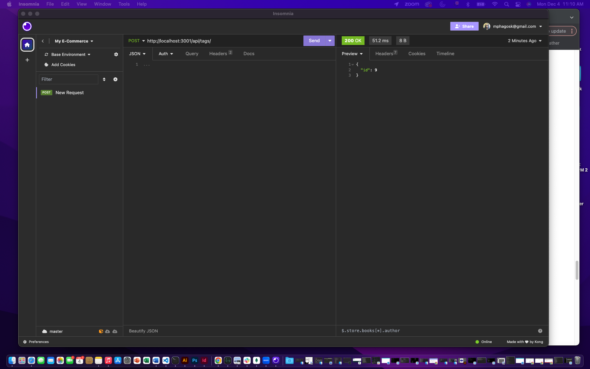

# E-Commerce_Back-End

## Task

This week's task is to build the back end for an e-commerce site by modifying starter code. Configure a working Express.js API to use Sequelize to interact with a MySQL database.
This application won’t be deployed, a link to the walkthrough video, that demonstrates the application's functionality, has to be submitted in the place of a deployed site.

## Links

- Github: [E-Commerce Back-End Repository](https://github.com/Saiishago/E-Commerce_Back-End)
- Walkthrough Video: [E-Commerce Back-End Walkthrough](https://drive.google.com/file/d/11z5TItN07HrJ0dn3T1woPWLbUr2QYigV/view?usp=sharing)

## Screenshots

- ### Application's GET routes

- ### Application's POST routes

- ### Application's PUT routes

- ### Application's DELETE routes

## How It Works

The following will be needed for the application to work:

To connect your Express.js API to a MySQL database.

- MySQL2: [MySQL2](https://www.npmjs.com/package/mysql2) package
- Sequelize: [Sequelize](https://www.npmjs.com/package/sequelize) package

To use environment variables to store sensitive data.

- Dotenv: [dotenv](https://www.npmjs.com/package/dotenv) package

Use the `schema.sql` file in the `db` folder to create your database with MySQL shell commands. Use environment variables to store sensitive data like your MySQL username, password, and database name.

---

© 2023 Salome K Mphago. E-Commerce Back-End. Object Relational Mapping.
